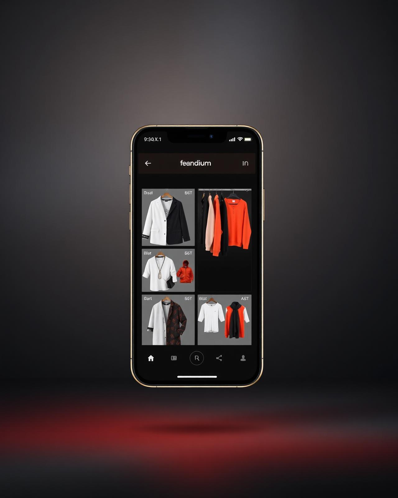

<div align="center">

  # DressMe AI — Seu Guarda-Roupa Inteligente

  <p align="center">
    <b>Fashion Tech</b> que une Inteligência Artificial, guarda-roupa digital e avatar 3D para revolucionar a forma como você se veste.
  </p>

  <p>
    <a href="#-funcionalidades">Funcionalidades</a> •
    <a href="#-tecnologias">Tecnologias</a> •
    <a href="#-como-rodar">Como Rodar</a> •
    <a href="#-deploy">Deploy</a>
  </p>

  
  
  
  

</div>

---

## 📸 Preview



A landing page apresenta uma experiência visual imersiva com gradientes vibrantes (vermelho coral → laranja), animações suaves e design responsivo — transmitindo inovação e estilo desde o primeiro scroll.

---

## ✨ Funcionalidades

A landing page é composta por **10 seções estratégicas** que contam a história completa do produto:

| Seção | Descrição |
|-------|-----------|
| **Navbar** | Navegação fixa com blur dinâmico, menu mobile responsivo e CTA de lista de espera |
| **Hero** | Headline impactante, estatísticas de engajamento, imagem do app com efeito de flutuação e botões de conversão |
| **Problema** | 4 cards que identificam as dores do público: tempo perdido, combinações difíceis, peças esquecidas e compras impulsivas |
| **Como Funciona** | Pipeline visual em 4 etapas: fotos → guarda-roupa digital → IA → avatar 3D |
| **Funcionalidades** | Showcase do app com 4 screenshots (guarda-rouba, recomendações, histórico, avatar) |
| **Avatar 3D** | Seção dedicada ao avatar interativo com visualização de looks em tempo real |
| **IA** | Explicação do motor de Inteligência Artificial e aprendizado de preferências |
| **Benefícios** | Argumentos de venda com ícones e descrições objetivas |
| **Depoimentos** | Social proof com avaliações de usuários beta |
| **Preços** | Tabela de planos Gratuito vs Premium com destaque visual para o plano mais popular |
| **CTA + Footer** | Chamada final para ação, links sociais, navegação e informações de contato |

### Destaques de UX/UI

- **Tema escuro premium** com paleta própria (vermelho coral `#E53935` → laranja `#FF6F00`)
- **Animações de scroll** e transições suaves em todos os componentes
- **Efeitos de glow** e gradientes radiais para profundidade visual
- **Totalmente responsivo** — desktop, tablet e mobile
- **Scroll suave** com âncoras em todas as seções
- **Tipografia moderna**: Space Grotesk (títulos) + Inter (corpo)

---

## 🛠 Tecnologias

| Tecnologia | Versão | Uso |
|------------|--------|-----|
| [React](https://react.dev/) | 19 | Biblioteca UI |
| [TypeScript](https://www.typescriptlang.org/) | 5.8 | Tipagem estática |
| [Tailwind CSS](https://tailwindcss.com/) | 4 | Estilização utilitária |
| [Vite](https://vitejs.dev/) | 8 | Build tool e dev server |
| [TanStack Router](https://tanstack.com/router) | 1.168 | Roteamento tipado |
| [TanStack Query](https://tanstack.com/query) | 5.83 | Gerenciamento de estado server |
| [Radix UI](https://www.radix-ui.com/) | 1.x | Componentes headless acessíveis |
| [Lucide React](https://lucide.dev/) | 0.575 | Ícones |
| [Framer Motion](https://www.framer.com/motion/) | *via Animate.css* | Animações declarativas |

---

## 📁 Estrutura de Pastas

```
dressme-ai/
├── public/                    # Assets estáticos (favicon, imagens públicas)
├── src/
│   ├── assets/                # Imagens do app e screenshots
│   │   ├── hero-app.jpg
│   │   ├── screen-wardrobe.jpg
│   │   ├── screen-recommendations.jpg
│   │   ├── screen-history.jpg
│   │   ├── screen-avatar.jpg
│   │   ├── avatar-3d.jpg
│   │   └── ai-visual.jpg
│   ├── components/
│   │   ├── landing/           # Seções da landing page
│   │   │   ├── Navbar.tsx
│   │   │   ├── Hero.tsx
│   │   │   ├── Problem.tsx
│   │   │   ├── HowItWorks.tsx
│   │   │   ├── AppShowcase.tsx
│   │   │   ├── AvatarSection.tsx
│   │   │   ├── AISection.tsx
│   │   │   ├── Benefits.tsx
│   │   │   ├── Testimonials.tsx
│   │   │   ├── Pricing.tsx
│   │   │   ├── CTA.tsx
│   │   │   └── Footer.tsx
│   │   └── ui/                # Componentes reutilizáveis (Button, Card, etc.)
│   ├── routes/                # Rotas do TanStack Router
│   │   ├── __root.tsx         # Layout raiz (head, meta, shell HTML)
│   │   └── index.tsx          # Página inicial (landing page)
│   ├── router.tsx             # Configuração do roteador
│   ├── styles.css             # Tailwind + tema customizado + animações
│   └── lib/                   # Utilitários e helpers
├── index.html                 # Entry point HTML
├── vite.config.ts             # Configuração do Vite
├── tsconfig.json              # Configuração do TypeScript
└── package.json
```

---

## 🚀 Como Rodar

### Pré-requisitos

- [Node.js](https://nodejs.org/) 18+ (recomendado: 20 LTS)
- npm (instalado automaticamente com o Node)

### 1. Clone o repositório

```bash
git clone https://github.com/seu-usuario/dressme-ai.git
cd dressme-ai
```

### 2. Instale as dependências

```bash
npm install
```

### 3. Inicie o servidor de desenvolvimento

```bash
npm run dev
```

O app estará disponível em `http://localhost:8080` (ou na porta indicada no terminal).

### 4. Build de produção

```bash
npm run build
```

Os arquivos otimizados serão gerados na pasta `dist/`.

### 5. Preview da build

```bash
npm run preview
```

Serve a build de produção localmente para validação.

---

## 📦 Deploy

A aplicação é **estática** (não requer backend), então pode ser hospedada em qualquer plataforma de static hosting:

| Plataforma | Instruções |
|------------|------------|
| **Vercel** | `vercel --prod` ou conecte o repo via dashboard |
| **Netlify** | Drag & drop da pasta `dist/` ou conecte via Git |
| **GitHub Pages** | Use o workflow de deploy do Vite ou `gh-pages` |
| **Cloudflare Pages** | Conecte o repo — build command: `npm run build`, output dir: `dist` |

> **Dica:** A landing page é 100% client-side. Não há APIs externas, banco de dados ou variáveis de ambiente obrigatórias para funcionar.

---

## 🎨 Identidade Visual

| Token | Valor | Uso |
|-------|-------|-----|
| **Brand Primary** | `#E53935` (coral) | Botões, gradientes, destaques |
| **Brand Orange** | `#FF6F00` | Acentos, animações de pulse |
| **Background** | `#121212` | Fundo escuro principal |
| **Surface** | `#1E1E1E` | Cards, modais, containers |
| **Font Display** | Space Grotesk | Títulos e headlines |
| **Font Body** | Inter | Textos e parágrafos |

---

## 📄 Licença

Este projeto está licenciado sob a [MIT License](LICENSE).

---

<div align="center">

  Feito com paixão por moda e tecnologia.

  <a href="https://github.com/seu-usuario/dressme-ai">
    
  </a>

</div>
